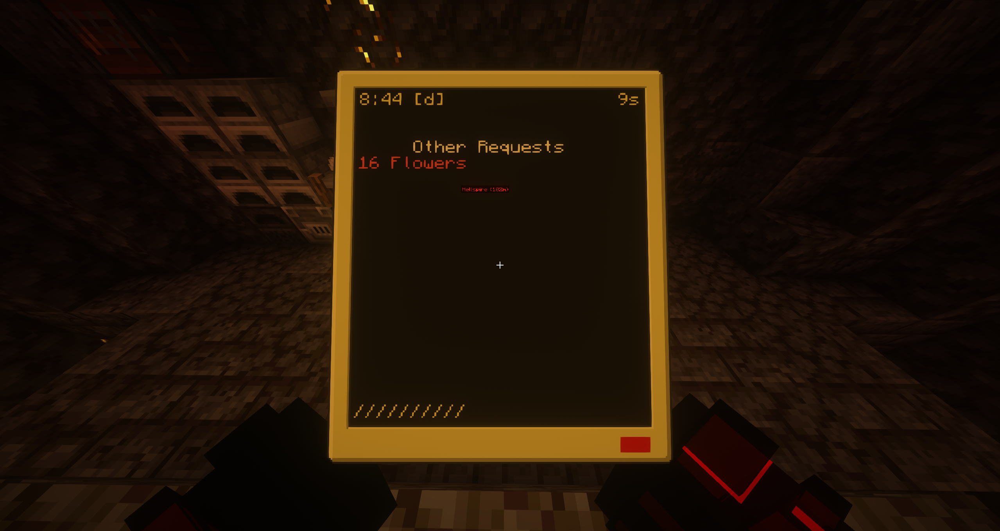

# RS Warehouse: Pocket Companion
> A companion script fo your Minecolonies and Refined Storage integration.



## Dependencies
To run the RS Warehouse script, you will need the following mods:

* CC: Tweaked [[Modrinth](https://modrinth.com/mod/cc-tweaked)]

> [!NOTE]
> You must also meet the dependencies for the [rs-warehouse](../rs-warehouse/README.md)script, as this is a companion tool designed to work alongside it.

## Required Items
To use the Pocket Companion, you will need to craft and set up the following items:

1. **Pocket Computer**: A basic Pocket Computer from CC: Tweaked.
2. **Wireless Modem** or **Ender Modem**: Install one of these modems into your Pocket Computer to enable wireless communication with the RS Warehouse network.
   * [Wireless Modem Wiki](https://tweaked.cc/peripheral/modem.html)

Once these items are crafted and set up, you're ready to install the script!

### Installing the Script
To install the script, run the following command in your terminal:
```craftos
wget https://github.com/parzival-space/cc-tweaked-scripts/releases/latest/download/rs-warehouse-pocket.lua startup/rs-warehouse-pocket.lua
```
This will download the script to your startup directory and run it upon system startup.

### Configuring the Script
After the script is run for the first time, a configuration file ``rsWarehousePocket.json`` will be created with the following default settings:
```json
{
    "targetHostname": "rsWarehouse",
    "use24HourFormat": true
}
```
* **targetHostname**: The name of the computer running the [rs-warehouse](../rs-warehouse-pocket/README.md) script.
* **use24HourFormat**: Whether to use a 24-hour time format.

You can edit this file to adjust the settings based on your preferences.

## License
This script is licensed under the MIT License. See [LICENSE](./LICENSE) for more details.