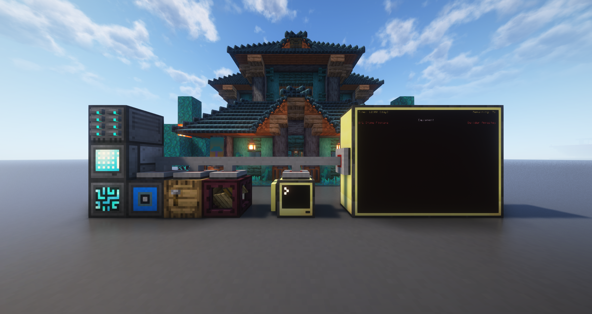
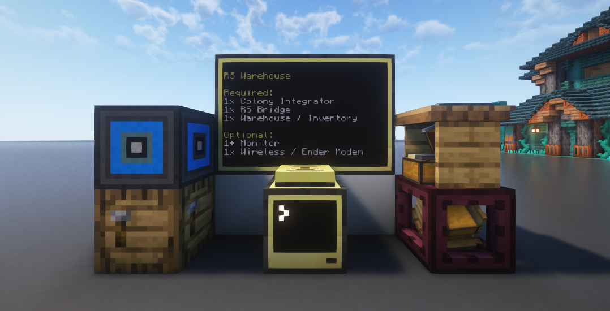

# RS Warehouse
> A Minecolonies and Refined Storage integration.



## Dependencies
* CC: Tweaked [[Modrinth](https://modrinth.com/mod/cc-tweaked)]
* Advanced Peripherals [[Modrinth](https://modrinth.com/mod/advancedperipherals), [Curseforge](https://www.curseforge.com/minecraft/mc-mods/advanced-peripherals)]
* Minecolonies [[Curseforge](https://www.curseforge.com/minecraft/mc-mods/minecolonies)]
* Refined Storage [[Modrinth](https://modrinth.com/mod/refined-storage), [Curseforge](https://www.curseforge.com/minecraft/mc-mods/refined-storage), [GitHub](https://github.com/refinedmods/refinedstorage/releases)]
* Entangled (Optional) [[Modrinth](https://modrinth.com/mod/entangled), [Curseforge](https://www.curseforge.com/minecraft/mc-mods/entangled)]

## Features
* Multi-Monitor Support: You can connect as many Monitors as you like.
* Autocrafting Scheduling: If the RS network does not have enought Items to satisfy a request, crafting jobs will be scheduled automatically.
* Smart Tier Selection: Automatically selects the highes Item tiers for Armor/Tools.
* Mod-Item Support: The Script will priorize Vanilla-Items over Mod-Items.
<!--* Wireless Monitoring: You can connect a Pocket Computer to monitor your request wirelessly.-->
<!--* NBT Support -->

## How to use this Script?
This section will

### Building Blocks


For this script to work you will need to connect a [RS Bridge](https://docs.advanced-peripherals.de/peripherals/rs_bridge/), a [Colony Integrator](https://docs.advanced-peripherals.de/peripherals/colony_integrator/) and the [Warehouse](https://minecolonies.com/wiki/buildings/warehouse) block of your Minecolonies Warehouse to the Computer.
You can connect the Warehouse using a [Wired Modem](https://tweaked.cc/peripheral/modem.html) or using an [Entangled Block](https://www.curseforge.com/minecraft/mc-mods/entangled).

Optionally, but highly recommended, you can also connect multiple [Monitors](https://tweaked.cc/peripheral/monitor.html) to display the status of all current colony requests.

<!--You can also connect a Wireless / Ender Modem. This will allow you to utilize the [rs-warehouse-pocket](../rs-warehouse-pocket/README.md) script.-->

> [!IMPORTANT]
> If you choose to connect the Warehouse using a wired Modem, it is important that you connect the RS Bridge using the same Wire.
> The exportItemToPeripheral() function won't be able to find the Warehouse inventory and simply fail to export your items.

### Installing the Script
To install this script, simply run the following command:
```craftos
wget https://github.com/parzival-space/cc-tweaked-scripts/releases/latest/download/rs-warehouse.lua startup/rs-warehouse.lua
```